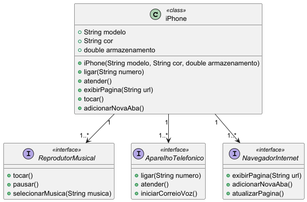

# Desafio de POO - Bootcamp Claro Java com Spring Boot

Este repositório contém a solução para o desafio de Programação Orientada a Objetos (POO) proposto no Bootcamp Claro Java com Spring Boot da [Digital Innovation One (DIO)](https://www.dio.me). O desafio original pode ser encontrado [neste repositório](https://github.com/digitalinnovationone/trilha-java-basico/tree/main/desafios/poo).

## 🎯 Objetivo do Desafio

O foco deste desafio é a **modelagem de classes** usando os conceitos da Programação Orientada a Objetos (POO) em Java, bem como a criação de um **diagrama UML** que represente as relações entre as classes. O projeto propõe a simulação de um catálogo de smartphones (iPhone) utilizando:

- Abstração
- Encapsulamento
- Herança
- Polimorfismo

## 📊 Modelagem UML

A modelagem do sistema foi representada utilizando a notação UML (Unified Modeling Language) para ilustrar a estrutura de classes e seus relacionamentos, facilitando o entendimento do design e arquitetura do sistema.

### 🖼️ Diagrama UML

O diagrama UML abaixo descreve a hierarquia e os relacionamentos entre as classes utilizadas na implementação do catálogo de iPhones:

### 📂 Descrição das Classes

1. **iPhone (Classe Base)**:  
   Esta é a classe principal que encapsula os atributos e comportamentos comuns a todos os modelos de iPhone. Exemplos de atributos incluem `modelo`, `capacidadeArmazenamento`, `cor` e `preco`.

   - **Atributos**:
     - `String modelo`
     - `int capacidadeArmazenamento`
     - `String cor`
     - `double preco`

   - **Métodos**:
     - `public void ligar()`
     - `public void desligar()`
     - `public void exibirDetalhes()`

2. **Subclasses (Herança)**:  
   A modelagem prevê a criação de subclasses que estendem a classe `iPhone`, representando diferentes variações ou gerações do aparelho. Exemplo: `iPhoneX`, `iPhone12`, etc.

   - **Métodos Sobrescritos (Polimorfismo)**:
     - Cada geração de iPhone pode sobrescrever comportamentos específicos, como a forma de exibição de detalhes no método `exibirDetalhes()`.

### 🔗 Relacionamentos

- **Herança**: As subclasses herdam características da classe base `iPhone`.
- **Polimorfismo**: Métodos são sobrescritos para customizar o comportamento das subclasses.
- **Associação**: A classe principal pode ser associada a outras classes de suporte, como `Bateria`, `Tela`, ou `Processador`, que definem componentes internos do iPhone.

## ✍️ Autor

Desenvolvido por [Alysson Zanchi](https://www.linkedin.com/in/alyssonzanchi/).

